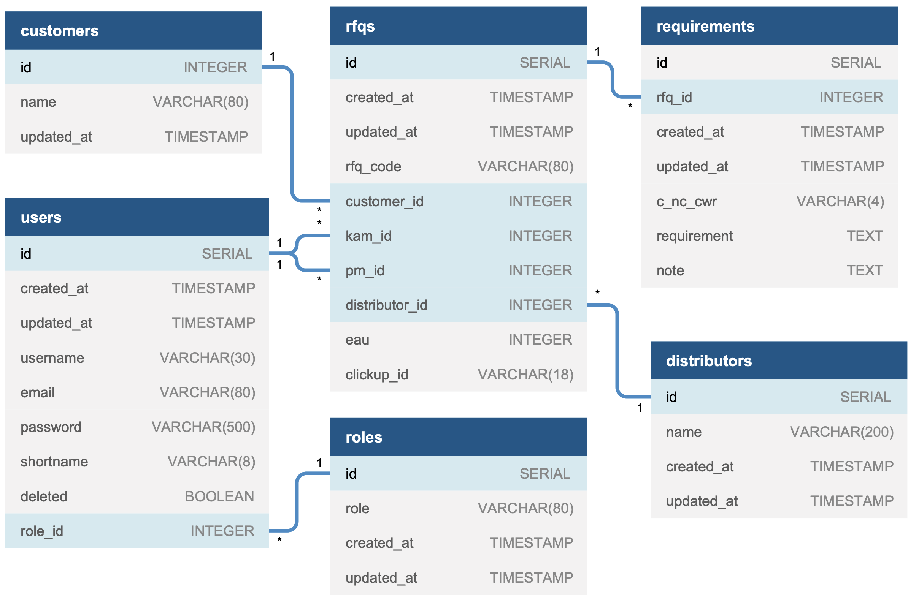

# `Backend` in Node.js & Typescript for **Riverdi RFQ** System

**Notice: This project is a REST API that is ment to work with [frontend GUI](link)**

<hr>

> The sole purpose of this project is to fullfill requirements of **[Riverdi](https://riverdi.com)** stakeholders (Riverdi Sales Department) in terms of creating an application for convienient **RFQ** (_Request For Quotation_) mangement and integrate it with current workflows that are run in [Comarch ERP XL](https://www.comarch.pl/erp/xl/), [ClickUp](https://clickup.com/) and [SharePoint](https://www.microsoft.com/pl-pl/microsoft-365/sharepoint/collaboration).

<hr>

## Main Features

- Add new RFQs
- Generate unique RFQ code (based on specification)
- list RFQs
- sort RFQs (handled on frontend)
- filter RFQs (handled on frontend)
- Add requirements (with notes) to existing RFQs
- All `CRUD` operations on: **RFQs, requirements, distributors and users**
- Comarch ERP XL integration (fetching customers)
- SharePoint Integration (creating specified folder structure, puting files)
- ClickUp Integration (creating tasks, assigning people, fetching task statuses)

## Data Model



## Migrations

In order to tie the database structure to the code (helpful when working with other engineers) I had to use **`schema migrations`** (_code that describes a precise change to make to the database_).

The tool of the choice is [node-pg-migrate](https://github.com/salsita/node-pg-migrate). All migratrons are written in plain SQL.

> What are **`schema migrations`** and how to use **node-pg-migrate** is out of the scope of this document.

## Data Layer Logic

I've created separate layer of utility methods to handle database operations.

They should be used in controller business logic instead of operating directly on database.

---

### User Repo

---

#### Method:

```Javascript
UserRepo.find();
```

#### Response (`Array` of `Objects`):

```Javascript
[{id, username, name, email, shortname, role_id}]
```

> Returns list of all users that are not admins and are not marked as `deleted`.

---

#### Method:

```Javascript
UserRepo.findWithAdmins();
```

#### Response (`Array` of `Objects`):

```Javascript
[{id, username, name, email, shortname, role_id}]
```

> Returns list of all users (admins included) that are not marked as `deleted`.

---

#### Method:

```Javascript
UserRepo.findById(id: string);
```

#### Response (`Object`):

```Javascript
{id, username, email, shortname, role_id}
```

> Returns user with matching ID (or returns empty object).

---

#### Method:

```Javascript
UserRepo.findByEmail(email: string);
```

#### Response (`Object`):

```Javascript
{id, username, email, password, shortname, role_id, deleted}
```

> Returns user with matching email (or returns empty object). Returned **hashed** password is for login logic purposes.

---

#### Method:

```Javascript
UserRepo.insert({
  username,
  password,
  email,
  shortname,
  role_id,
}: {
  username: string;
  password: string;
  email: string;
  shortname: string;
  role_id: string;
});
```

#### Response (`Object`):

```Javascript
{id, username, email, shortname, role_id}
```

> Inserts new user into database. Shortname and email have to be unique. **Password should be srored in a hashed form!** _(route controller logic should handle that)_

---

## API (endpoints documentation)

## Tests

## Screenshots

## How to use it

## How to develop it

git flow

## Future optimalisations

server side sorting + data pagination

## Infrastructure (backend, frontend, database, cookies)

## Security

## Installation

## Configuration

# Project Name

> Abstract of the project or small introduction of what the project is about

<hr>

## Table of Contents

- [Team Members](#team-members)
